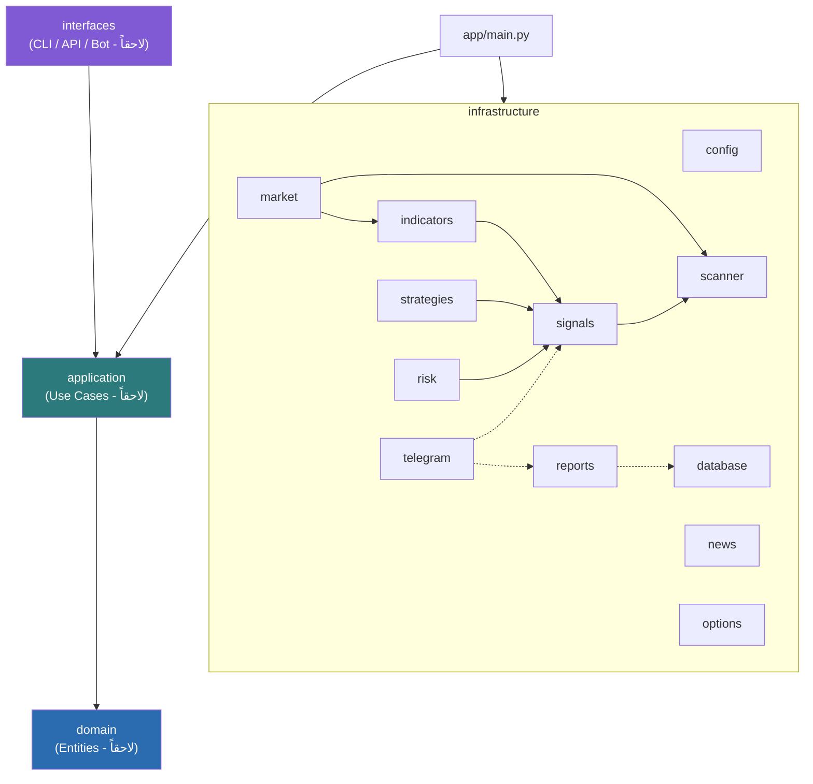
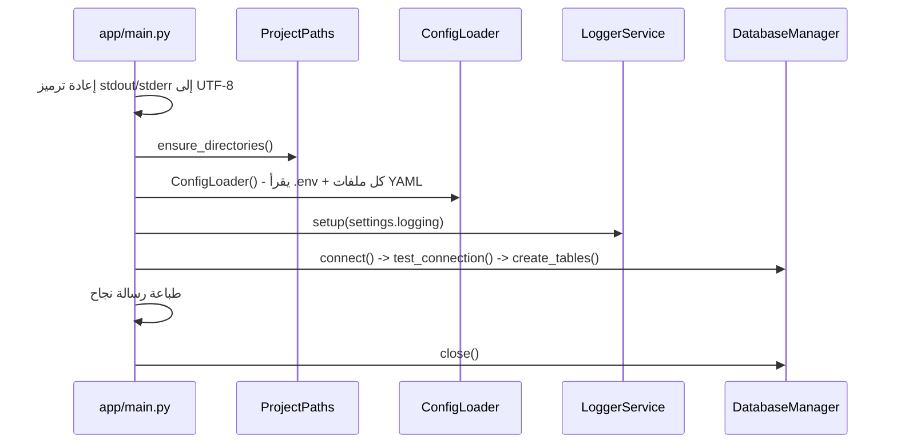
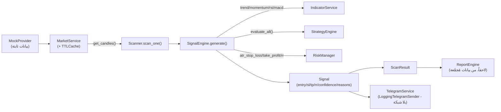

# Market Signals Platform

مشروع Python مؤسَّس على Clean Architecture لبناء بوت تحليل وإشارات
أسهم/خيارات - **الأساس المعماري الكامل** جاهز الآن (تأسيس، قاعدة
بيانات، بيانات سوق، مؤشرات فنية، إشارات، استراتيجيات، مخاطرة، فحص،
أخبار، خيارات، تقارير، Telegram) - **بلا أي اتصال إنترنت أو API خارجي
حقيقي في أي طبقة** (Mock/Logging فقط في كل مكان يحتاج بيانات/إرسالاً
خارجياً). ربط مزوّدين حقيقيين (Polygon/Alpaca/Tradier إلخ) لاحقاً لا
يحتاج أي إعادة هيكلة - فقط كتابة صفوف جديدة تطبّق الواجهات المجرَّدة
الموجودة.

## Architecture Diagram

القاعدة الذهبية لـ Clean Architecture: الاعتماد يتجه دائماً إلى الداخل.
كل طبقات `infrastructure/*` (باستثناء `database/`) مستقلة عن بعضها
البعض إلا عبر تركيب صريح (Composition) في نقطة تجميع واحدة - لا توجد
اعتمادات دائرية.



- **`domain`/`application`**: فارغتان حالياً - محجوزتان لمنطق العمل الصافي (Use Cases) في مراحل قادمة.
- **`interfaces`**: فارغة - نقاط الدخول المستقبلية (CLI/API/Bot حقيقي).
- **`infrastructure`**: كل التفاصيل التقنية الفعلية - الطبقة العاملة بالكامل حتى الآن.

## Folder Structure

```
market-signals-platform/
├── app/
│   ├── main.py                          نقطة التشغيل الوحيدة
│   ├── domain/                          فارغة - محجوزة
│   ├── application/                     فارغة - محجوزة
│   ├── interfaces/                      فارغة - محجوزة
│   └── infrastructure/
│       ├── paths.py                     ProjectPaths
│       ├── config/                      ConfigLoader + Environment + كل Dataclasses الإعدادات
│       ├── logging/                     LoggerService (Loguru)
│       ├── database/                    DatabaseManager + Repository (عام + 4 متخصصة) + 4 نماذج
│       ├── market/                      MarketDataProvider (ABC) + MockProvider + MarketService + TTLCache
│       ├── indicators/                  14 مؤشراً + IndicatorService + IndicatorRegistry (OCP)
│       ├── signals/                     SignalEngine + Signal + ConfidenceWeights
│       ├── strategies/                  5 استراتيجيات + StrategyEngine + StrategyRegistry (OCP)
│       ├── risk/                        RiskManager + RiskSettings
│       ├── scanner/                     Scanner (متوازٍ) + ScannerScheduler
│       ├── news/                        NewsProvider (ABC) + MockNewsProvider + NewsService + Scoring + Sentiment
│       ├── options/                     OptionsProvider (ABC) + MockOptionsProvider + OptionsService + Liquidity
│       ├── reports/                     ReportEngine (يومي/أسبوعي/شهري/أداء)
│       └── telegram/                    TelegramService + Formatters + TelegramSender (ABC) + LoggingTelegramSender
├── config/
│   ├── settings.yaml                    عام + risk + reports + news + options
│   ├── symbols.yaml                     قائمة الرموز
│   ├── scanner.yaml                     رموز/أطر زمنية/فترة/Workers
│   └── telegram.yaml                    enabled فقط (الأسرار من .env)
├── logs/ data/ reports/ temp/           تُنشأ تلقائياً عند التشغيل
├── tests/                               12 ملف اختبار - 157 اختباراً حقيقياً (راجع Testing Guide)
├── .env.example
├── requirements.txt                     إصدارات مثبَّتة بالكامل (==)
└── README.md
```

## Startup Flow



لا يوجد أي تعديل على `sys.path` - الاستيراد يعمل عبر `python -m app.main`
من جذر المشروع فقط.

## Data Flow (خط أنابيب فحص إشارة واحدة)

هذا هو المسار الفعلي الذي يمر منه أي فحص - Scanner لا يستدعي كل طبقة
يدوياً، بل يستدعي `SignalEngine.generate()` فقط، والذي بدوره يُنسِّق
البقية داخلياً عبر التركيب (Composition):



## Dependency Injection

كل خدمة رئيسية تستقبل تبعياتها عبر المُنشئ (Constructor) - لا Singletons
عالمية مخفية، ولا استيراد مباشر لتطبيق مُحدَّد داخل خدمة أخرى:

```python
provider = MockProvider()                      # 1. اختر التطبيق (Provider)
market_service = MarketService(provider)        # 2. حقنه في الخدمة
signal_engine = SignalEngine()                  # 3. تُنشئ StrategyEngine/RiskManager افتراضياً داخلياً (قابلة للحقن أيضاً)
scanner = Scanner(market_service, signal_engine) # 4. حقن كل شيء في Scanner

# لاحقاً - تبديل المزود بالكامل بلا أي تعديل آخر:
# provider = PolygonProvider(api_key=...)
# market_service = MarketService(provider)
```

نفس النمط تماماً في: `NewsService(provider)`، `OptionsService(provider)`،
`TelegramService(sender)`، و`IndicatorService(registry)` /
`StrategyEngine(registry)`.

## كيفية الإضافة (Open/Closed - بلا تعديل كود قائم)

### إضافة مؤشر جديد
```python
from app.infrastructure.indicators.base import Indicator

class MyIndicator(Indicator):
    name = "my_indicator"
    def min_candles_required(self, **params): return 20
    def calculate(self, candles, **params): ...

service = IndicatorService()
service.register(MyIndicator())
service.calculate("my_indicator", candles)
```
(مُختبَر فعلياً في `tests/test_indicators.py::test_open_closed_extensibility_...`)

### إضافة استراتيجية جديدة
```python
from app.infrastructure.strategies.base import Strategy

class MyStrategy(Strategy):
    name = "my_strategy"
    def min_candles_required(self): return 30
    def evaluate(self, candles): ...

engine = StrategyEngine()
engine.register(MyStrategy())
```
(مُختبَر فعلياً في `tests/test_strategies.py::test_open_closed_extensibility_...`)

### إضافة مزود بيانات حقيقي (سوق/أخبار/خيارات)
اكتب صفاً يطبّق `MarketDataProvider` (أو `NewsProvider`/`OptionsProvider`)
بالكامل، ثم مرِّره لنفس `MarketService`/`NewsService`/`OptionsService` -
لا تعديل على أي كود آخر. مثال:
```python
class PolygonProvider(MarketDataProvider):
    def get_quote(self, symbol): ...       # طلب HTTP حقيقي هنا فقط
    def get_candles(self, symbol, timeframe, limit=100): ...
    def get_market_status(self): ...
    def health_check(self): ...

market_service = MarketService(PolygonProvider(api_key=...))
```

### إضافة مُرسِل Telegram حقيقي
```python
class RealTelegramSender(TelegramSender):
    def send(self, chat_id, text) -> bool:
        # python-telegram-bot أو httpx مباشرة إلى Bot API هنا فقط
        ...

telegram_service = TelegramService(sender=RealTelegramSender(bot_token=...))
```

## Configuration Guide

| الملف | يحوي | سرّي؟ |
|---|---|---|
| `.env` | `ENVIRONMENT`, `LOG_LEVEL`, `DATABASE_URL`, `TELEGRAM_BOT_TOKEN`, `TELEGRAM_ADMIN_CHAT_ID` | ✅ نعم |
| `config/settings.yaml` | app, logging, **risk**, **reports**, **news**, **options** | ❌ لا |
| `config/symbols.yaml` | قائمة الرموز الافتراضية | ❌ لا |
| `config/scanner.yaml` | symbols (تخصيص اختياري)، timeframes، interval_seconds، max_workers | ❌ لا |
| `config/telegram.yaml` | `enabled` فقط (بلا أي سرّ) | ❌ لا |

كل الإعدادات تُقرأ مرة واحدة عبر `ConfigLoader()` وتُتاح كـTyped
Dataclasses جاهزة (`settings.risk.max_open_positions` مثلاً - Type
Hints كاملة، بلا `dict` خام في أي مكان يستهلك الإعدادات).

`TELEGRAM_BOT_TOKEN`/`TELEGRAM_ADMIN_CHAT_ID`: **موجودان في `.env` لكن
غير مُستخدَمين فعلياً في أي اتصال شبكة** - `TelegramService` يستخدم
`LoggingTelegramSender` دائماً حتى لو مُلئا، إلى أن يُربَط
`TelegramSender` حقيقي (راجع "كيفية الإضافة" أعلاه).

**Validation**: ملف YAML مفقود (`settings.yaml`/`symbols.yaml`) أو
بصيغة خاطئة يرفع `ConfigFileNotFoundError`/`ConfigParseError` واضحاً.
`scanner.yaml`/`telegram.yaml` اختياريان (قيم افتراضية معقولة إن غابا).

## Testing Guide

```bash
pytest tests/ -v              # كل الاختبارات (157 اختباراً)
pytest tests/test_signals.py -v   # ملف واحد فقط
```

| الملف | العدد | يغطي |
|---|---|---|
| `test_database.py` | 11 | CRUD كامل، Rollback، Repositories متخصصة |
| `test_market.py` | 26 | النماذج، TTLCache، MockProvider، MarketService |
| `test_indicators.py` | 30 | 14 مؤشراً مقابل تطبيقات مرجعية مستقلة |
| `test_signals.py` | 6 | SignalEngine كامل الحقول، أوزان قابلة للتخصيص |
| `test_strategies.py` | 14 | 5 استراتيجيات + StrategyEngine + OCP |
| `test_risk.py` | 16 | كل حسابات RiskManager بقيم يدوية |
| `test_scanner.py` | 9 | فحص متوازٍ، إحصائيات، Progress، Scheduler حقيقي (Threading) |
| `test_news.py` | 11 | MockNewsProvider، Sentiment، Scoring |
| `test_options.py` | 12 | MockOptionsProvider، Greeks، Liquidity |
| `test_reports.py` | 11 | يومي/أسبوعي/شهري/أداء بقيم يدوية |
| `test_telegram.py` | 12 | كل المُنسِّقات + TelegramService (بلا شبكة) |

**منهجية التحقق**: قيم يدوية بسيطة حيث ممكن، تطبيقات مرجعية مستقلة
(حلقات Python بدون numpy، بلا إعادة استخدام كود إنتاجي) للحسابات
المركَّبة، وسيناريوهات مُنشأة عمداً بنتيجة لا لبس فيها (اتجاه صاعد/هابط
نظيف، سعر ثابت تماماً، حجم 10 أضعاف المتوسط). **صفر Mock لمنطق العمل
نفسه** - فقط لحدود الشبكة الخارجية (MockProvider/LoggingTelegramSender).

## Deployment Guide

```bash
git clone <repo>   # أو فك ضغط الملفات
cd market-signals-platform
python3.12 -m venv venv
# Windows: venv\Scripts\Activate.ps1  |  Linux/Mac: source venv/bin/activate
pip install -r requirements.txt
cp .env.example .env   # عدّل القيم إن لزم - القيم الافتراضية كافية للتشغيل المحلي
python -m app.main
```

**لا يوجد بعد** أي نشر إنتاجي حقيقي (Docker/Systemd/Supervisor) - هذا
خارج نطاق هذه المرحلة (بنية معمارية فقط). عند إضافة مزود بيانات حقيقي
لاحقاً، أضِف مفاتيحه إلى `.env` فقط - لا حاجة لأي تعديل في الكود.

## Future Roadmap

```
✅ 1. Foundation (Clean Architecture + Config + Logging)
✅ 2. Database Layer (SQLAlchemy 2.x + Repository Pattern)
✅ 3. Market Data Layer (Provider Interface + MockProvider)
✅ 4. Indicator Engine (14 مؤشراً + OCP)
✅ 5. Signal Engine (دمج مؤشرات + ثقة مُرجَّحة قابلة للتخصيص)
✅ 6. Strategy Engine (5 استراتيجيات + OCP)
✅ 7. Risk Manager (حجم مركز/وقف/هدف/RR/حدود يومية)
✅ 8. Scanner (متوازٍ + Scheduler + إحصائيات)
✅ 9. News Layer (واجهة + Mock + Scoring/Sentiment)
✅ 10. Options Layer (واجهة + Mock + Greeks/Liquidity Placeholders)
✅ 11. Report Engine (يومي/أسبوعي/شهري/أداء)
✅ 12. Telegram Layer (بنية كاملة + Mock - بلا توكن حقيقي)
⏳ 13. ربط مزوّد بيانات سوق حقيقي (Polygon/Alpaca/Tradier) خلف MarketDataProvider
⏳ 14. ربط مزوّد أخبار حقيقي خلف NewsProvider
⏳ 15. ربط مزوّد خيارات حقيقي خلف OptionsProvider
⏳ 16. ربط بوت Telegram حقيقي خلف TelegramSender (توكن فعلي)
⏳ 17. طبقة Application/Domain (Use Cases فعلية تربط كل ما سبق ببعضه)
⏳ 18. نشر إنتاجي حقيقي (Docker/Systemd/مراقبة)
```

كل نقطة من 13-16 = كتابة صف واحد يطبّق واجهة موجودة بالفعل - **بلا أي
إعادة هيكلة**، بالضبط كما هو مخطَّط منذ المرحلة الأولى.

## الحالة الحالية

- ✅ Clean Architecture كاملة، بلا `sys.path.insert`، بلا `BASE_DIR` عالمي
- ✅ `ConfigLoader` + `Environment` Enum + Validation واضح لكل ملفات YAML
- ✅ قاعدة بيانات كاملة (SQLAlchemy 2.x، Repository عام + 4 متخصصة)
- ✅ بيانات سوق مستقلة عن أي مزود (Provider/Mock/Service/Cache)
- ✅ **14 مؤشراً فنياً** (OCP، صفر اعتماد على مزود خارجي)
- ✅ **SignalEngine كامل الحقول** (entry/stop_loss/take_profit/risk_reward/strategy_used/indicators_used/reasons) بأوزان ثقة قابلة للتخصيص
- ✅ **5 استراتيجيات مستقلة** (OCP) + StrategyEngine
- ✅ **RiskManager كامل** (حجم مركز، وقف ثابت/ATR، هدف، RR، حدود يومية/مراكز مفتوحة)
- ✅ **Scanner متوازٍ** (رموز×أطر زمنية، Progress، إحصائيات) + Scheduler حقيقي (Threading مُختبَر)
- ✅ **News/Options**: واجهات + Mock كاملان، بلا أي API حقيقي
- ✅ **ReportEngine**: يومي/أسبوعي/شهري/أداء + إحصائيات استراتيجيات
- ✅ **Telegram**: بنية كاملة (Formatters + Service) بلا توكن/اتصال حقيقي
- ✅ 144 ملفاً، 38 مجلداً، **157 اختباراً حقيقياً - كلها PASS**
- ✅ `python -m app.main` يعمل فعلياً (تشغيل من الصفر + إعادة تشغيل - تحقّقتُ بالتنفيذ الفعلي)
- ⏳ لا يوجد بعد: أي مزوّد بيانات/أخبار/خيارات/Telegram حقيقي، ولا طبقة Application/Domain فعلية، ولا نشر إنتاجي
